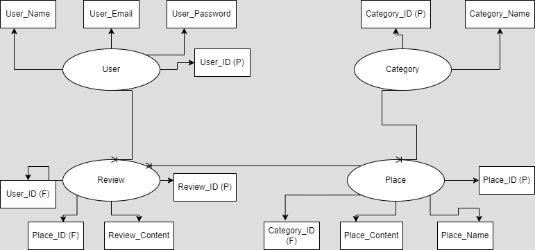

Project #2: Full Stack Application

Owlly Application:
    Project Made by Group Seven; Mohammed Nasser, Marwa AlKhashram, and Samia Jamal.

Owlly Logo

Description
    Owlly is an Entertainment Application targeted to users that seek to discover the entertaining locations and activities in Bahrain. Owlly will be available for all audiences that range from Bahrainis and tourists that wish to seek enjoyable outdoor activities. 

WireFrame

Entity Relationship Diagram

User Stories
    - User must be able to Sign Up.
    - User must be able to Login.
    - User must be able to Logout.
    - User must have a Profile.
    - User must be able to upload a Profile Picture.
    - User must be able to Edit their Personal Information.
    - User must be able to Read the content of the Application.
    - User must be able to Create a Review.
    - User must be able to View the Reviews.
    - User must be able to Edit a Review.
    - User must be able to Delete a Review.
    - User must not be able to edit or delete Other Users' Reviews.

Admin Stories
    - Admin must be able to Login.
    - Amin must be able to Logout.
    - Admin must be able to Create a Category.
    - Admin must be able to Add a Place of Entertainment.
    - Admin must be able to Delete Reviews.
    - Admin must be able to View Users information.
    - Admin must be able to Delete a User.
   
Modules/Languages Used For The Projects
    - NodeJS
    - Express
    - EJS 
    - Express-EJS-Layouts
    - Multer
    - Mongoose
    - MongoDB
    - Passport
    - HTML
    - CSS
    - JavaScript
