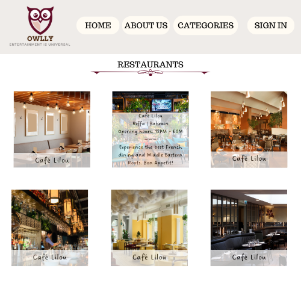
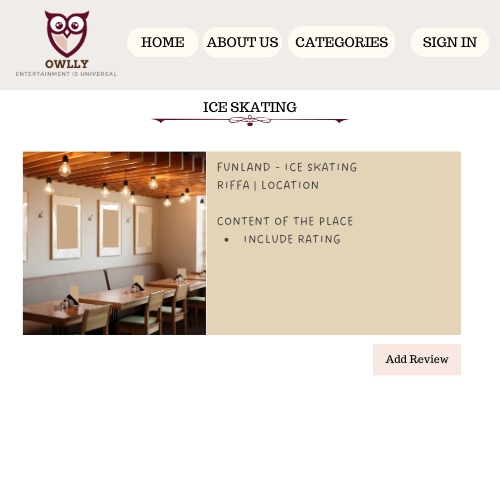
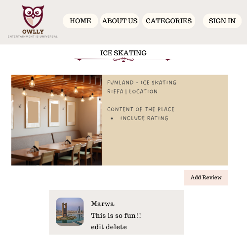
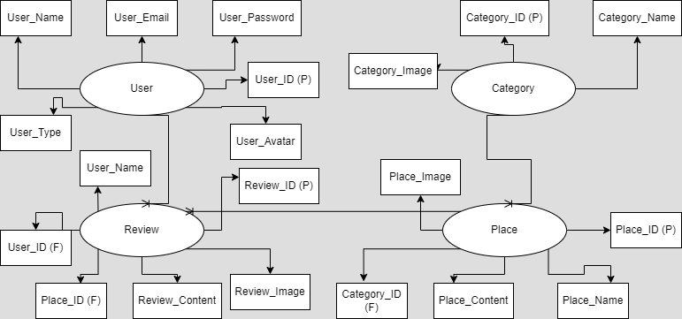

Project #2: Full Stack Application

Owlly Application:
    Project Made by Group Seven; Mohammed Nasser, Marwa AlKhashram, and Samia Jamal.

Owlly Logo

Description
    Owlly is an Entertainment Application targeted to users that seek to discover the entertaining locations and activities in Bahrain. Owlly will be available for all audiences that range from Bahrainis and tourists that wish to seek enjoyable outdoor activities. 

Instructions of the Application: About Owlly Application
Viewer will be able to Sign up using their google account and proceed to view the places by browsing through the categories and the places to discover Bahrain. The application targets people that wants to experience a memorable time. Adding a review to the places will help share the spent time of enjoyment with other people. 

Users can click on their username and edit their information, furthermore, they can upload profile pictures from their devices. 

An admin will be able to Login and make the necessary changes such as adding a place with the content and uploaded content. Along with the addition of categories and uploaded pictures. Admins also have the permissions to delete categories, places, and reviews. 

WireFrame:
The designed wireframes to understand the concept of the application and structure. The displayed wireframes are for the home page, category details, place details, and reviews.

Entity Relationship Diagram

Trello Board

User Stories
    - User must be able to Sign Up.
    - User must be able to Login.
    - User must be able to Logout.
    - User must have a Profile.
    - User must be able to upload a Profile Picture.
    - User must be able to Edit their Personal Information.
    - User must be able to Read the content of the Application.
    - User must be able to Create a Review.
    - User must be able to View the Reviews.
    - User must be able to Edit a Review.
    - User must be able to Delete a Review.
    - User must not be able to edit or delete Other Users' Reviews.

Admin Stories
    - Admin must be able to Login.
    - Amin must be able to Logout.
    - Admin must be able to Create a Category.
    - Admin must be able to Add a Place of Entertainment.
    - Admin must be able to Delete Reviews.
    - Admin must be able to View Users information.
    - Admin must be able to Delete a User.
   
Modules/Languages/Libraries Used For The Projects
* NodeJS
* Express
* EJS 
* Express-EJS-Layouts
* Multer
* Mongoose
* MongoDB
* Passport
* HTML
* CSS
* JavaScript
* Bootstrap

List of Unsolved Problems/ Difficult Part
The problems consisted of displayed places for each category. The connection between the listed places and a category was the main problem of our application and the time was mostly spend on that concept. 

Future Enhancement of Owlly Application
The future features of the application aim to enhance the application's appearance and funcitons. The future enhancement is applying a drop down feature for the category to enable the users to navigate the application easily. Adding more categories that represents more entertainment areas in Bahrain. Inserting a search bar to grant simple access to specific places that the viewer might be searching for. 

